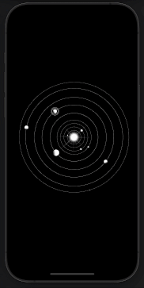
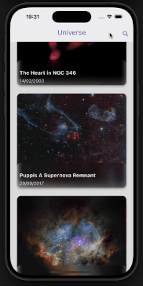

# Universe app

Project made using the bloc state management architecture pattern, but without using the package. The Project consists of retrieving images from the [NASA API](https://api.nasa.gov) and listing them to the user, who in turn, can access information related to images. There is also the possibility for the user to filter the images by data and image title. Storage was also applied to the project so that the user has the possibility of keeping the last listing made locally if offline. In addition, the project has some animations to make the user experience more pleasant.

--------------------------------------------------------------------------------------------------------------------------------

Projeto feito utilizando o padrão de arquitetura de gerenciamento de estado bloc, porém sem utulização do package. O Projeto consiste em recuperar imagens da [API da NASA](https://api.nasa.gov) e listar para usuário, que por sua vez, pode acessar informações referentes a images. Também há a possíbilidade do usuário filtrar as imagens por datas e título das imagens. Também foi aplicado ao projeto um storage para o usuário ter a possibilidade de ficar com a ultima listagem feita guaradada localmente em caso de estar offline, além disso, o projeto conta com algumas animações para deixar o experiencia do usuário mais agradável.


## Getting Started
> [!NOTE]
>Clone the repository and run the following commands:
--------------------------------------------------------------------------------------------------------------------------------
> [!NOTE]
> Clone o repositório e execute os seguintes comandos:
```
flutter pub get
flutter run
```

## Screenshots

### Universe app

Here we can see the app initialization using a screen transition animation, applying a lottie animation to the splash

Aqui podemos ver a inicialização do app utilizando uma animação de treansição de tela, aplicando uma animação do lottie na splash



--------------------------------------------------------------------------------------------------------------------------------

Here we can see how the user can filter the list of images returned by the API

Aqui podemos ver como o usuário pode filtrar a listagem das imagens retornadas pela API

By title
Por tilitulo



By date
Por datas


--------------------------------------------------------------------------------------------------------------------------------
And finally we can see how the user can stay with the last listing made, locally, in case they use the app offline.

E enfim podemos ver como usuário pode permanecer com a ultima listagem feita, localmente, para o caso de utulizar o app offline.


--------------------------------------------------------------------------------------------------------------------------------
> [!TIP]
> A few resources to get you started if this is your first Flutter project:

> [!TIP]
> Alguns recursos para você começar se este for seu primeiro projeto Flutter:

- [Lab: Write your first Flutter app](https://docs.flutter.dev/get-started/codelab)
- [Cookbook: Useful Flutter samples](https://docs.flutter.dev/cookbook)

For help getting started with Flutter development, view the
[online documentation](https://docs.flutter.dev/), which offers tutorials,
samples, guidance on mobile development, and a full API reference.
